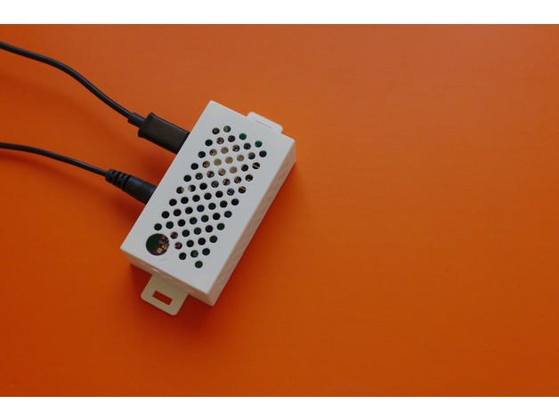

# Sensor enclosure

A customizable enclosure for sensor PCB. Especially for IoT devices, sensors. The dimensions of the box depend on the parameters of the PCB

**Features**

- Optional ventilation holes at top and/or sides
- Optional hole for sensor at top
- Optional rectangular and/or circular hole at sides
- Lid with 2/4 holes for socket or flat head screws
- Optional enclosure mounting tab on lid

