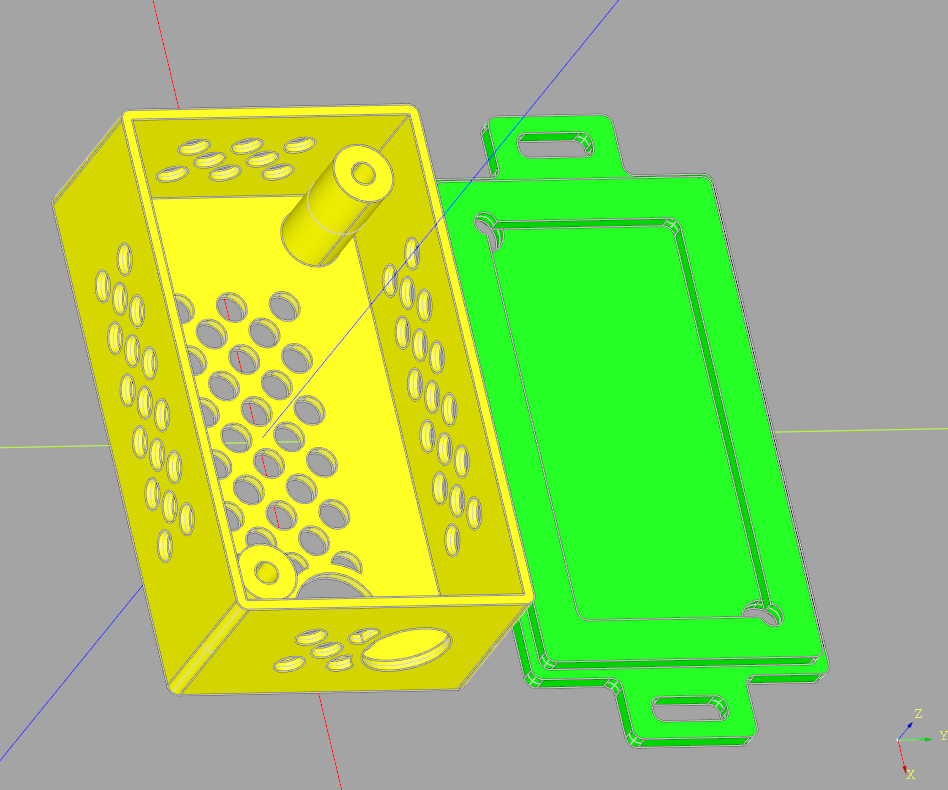

# Sensor enclosure

A customizable enclosure for sensor PCB. Especially for IoT devices, sensors. The dimensions of the box depend on the parameters of the PCB

**Features**

- Optional ventilation holes at top and/or sides
- Optional hole for sensor at top
- Optional rectangular and/or circular hole at sides
- Lid with 2/4 holes for socket or flat head screws
- Optional enclosure mounting tab on lid

**Usage**

- Install the [CadQuery and the CQ-Editor](https://cadquery.readthedocs.io/en/latest/installation.html)
- Create a TOML configuration file or modify the esp12f_sensor.toml file
- Edit the configuration file name at the beginning of sensor_enclosure.py

